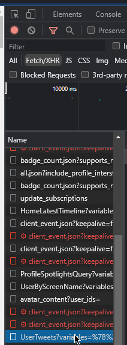

# What

This is a dumb script to periodically check a Twitter profile's following/follower list for any changes and tells a Discord webhook about it.

# How do

- Download [node.js](https://nodejs.org/en)
- Clone/download this repository
- Open a terminal in the repo folder
- Do `npm install node-fetch`
- Open Twitter, open Chrome/Firefox's dev tools, go to the network tab
- Filter by Fetch/XHR
- Do something such as going to your profile
- Look at the list of requests and click on the relevant one:

    
- Scroll down until you see "Request Headers":

    
- Duplicate `conf-example.json` and rename it to `conf.json`
- Open `conf.json` in an editor, and do the following, referencing the Request Headers:
    - Set `userId` to your user ID
    - Set `auth` to the `authorization` field in the Request Headers, should usually start with `Bearer`
    - Set `cookie` to the `cookie` field in the Request Headers (you will need to escape the quotation marks)
    - Set `csrf` to the `x-csrf-token` field in the Request Headers
    - Tune `waitMs` to a delay of your liking, but you probably should leave it alone
    - Set `webhook` to the url of your Discord webhook
    - Set `myDiscord` to your Discord user ID so that you get pinged for each detected change
- Back in the terminal, run `node checkers.js`
- If everything goes right, the script will begin doing its thing.

For running the script outside a terminal window that's up to you to figure out.

# Why

Because I kept seeing my following counter changing every so often for no reason and it was mostly people deactivating, but I wanna know if someone DOES sb me for whatever reason